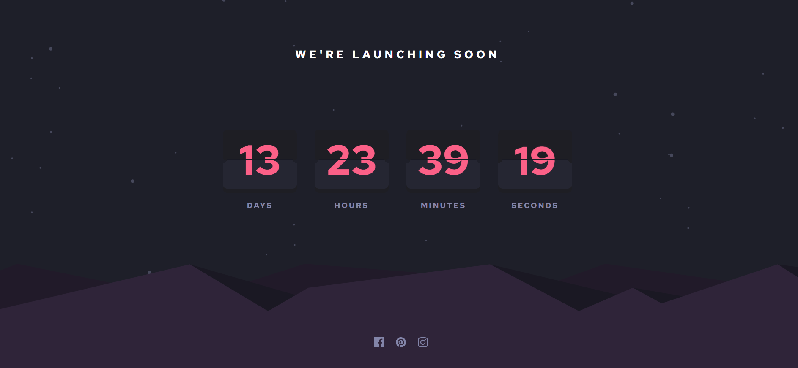

# Frontend Mentor - Launch countdown timer solution

This is a solution to the [Launch countdown timer challenge on Frontend Mentor](https://www.frontendmentor.io/challenges/launch-countdown-timer-N0XkGfyz-). Frontend Mentor challenges help you improve your coding skills by building realistic projects. 

## Table of contents

- [Overview](#overview)
  - [The challenge](#the-challenge)
  - [Screenshot](#screenshot)
  - [Links](#links)
- [My process](#my-process)
  - [Built with](#built-with)
  - [What I learned](#what-i-learned)
  - [Continued development](#continued-development)
  - [Useful resources](#useful-resources)
- [Author](#author)
- [Acknowledgments](#acknowledgments)

## Overview

### The challenge

Users should be able to:

- See hover states for all interactive elements on the page
- See a live countdown timer that ticks down every second (start the count at 14 days)
- **Bonus**: When a number changes, make the card flip from the middle

### Screenshot

- Main: 

### Links

- Solution URL: [https://github.com/Jo-cloud85/launch-countdown-timer.git](https://github.com/Jo-cloud85/launch-countdown-timer.git)
- Live Site URL: [https://Jo-cloud85.github.io/launch-countdown-timer](https://Jo-cloud85.github.io/launch-countdown-timer)


## My process

### Built with

- Semantic HTML5 markup
- CSS custom properties
- Flexbox
- CSS Grid
- Mobile-first workflow

### What I learned

I learnt about a web API method called requestAnimationFrame & cancelAnimationFrame.

Definition of requestAnimationFrame: "RequestAnimationFrame is an animation method in JavaScript that tells the browser to call a specific function and update the animation for the next repaint. It reduces the animation load on a CPU and allows the animations to run more smoothly."

Usually, we would write our animation code using setTimeout like this:
```
setInterval(() => {
  // animation code
}, 1000/60);
```

But by using requestAnimationFrame, there are 2 reasons why it is more effective:
- Its animations are smoother because the function is optimized.
- Animations in the inactive tabs will stop running, which allows the CPU to chill.

On the other hand, "the window.cancelAnimationFrame() method cancels an animation frame request previously scheduled through a call to window.requestAnimationFrame()."


Code snippet that uses requestAnimationFrame and cancelAnimationFrame
```
requestAnimationFrame(this.updateClock);

if (this.i++ % 10) return;

const { Total, ...timeRemaining } = this.getTimeRemaining();

if (Total < 0) {
    cancelAnimationFrame(this.timeinterval);
    for (const key in this.timeObj) {
        this.timeObj[key].update(0);
    }
    this.callback();
    return;
}

for (const key in this.timeObj) {
    this.timeObj[key].update(timeRemaining[key]);
}
```

### Useful resources

- [Build a Countdown Timer in Just 18 Lines of JavaScript](https://www.sitepoint.com/build-javascript-countdown-timer-no-dependencies/) - Basic principles of a countdown timer
- [9 Free Open Source Flipping Clocks Using CSS and JavaScript](https://1stwebdesigner.com/9-free-open-source-flipping-clocks-using-css-javascript/)
- [CSS Generators](https://css-generators.com/custom-corners/)
- [RequestAnimationFrame in Javascript](https://builtin.com/software-engineering-perspectives/requestanimationframe)
- [How to Stop requestAnimationFrame in Javascript](https://codinhood.com/nano/js/stop-request-animation-frame-javascript/)


## Author

- Frontend Mentor - [@Jo-cloud85](https://www.frontendmentor.io/profile/Jo-cloud85)
